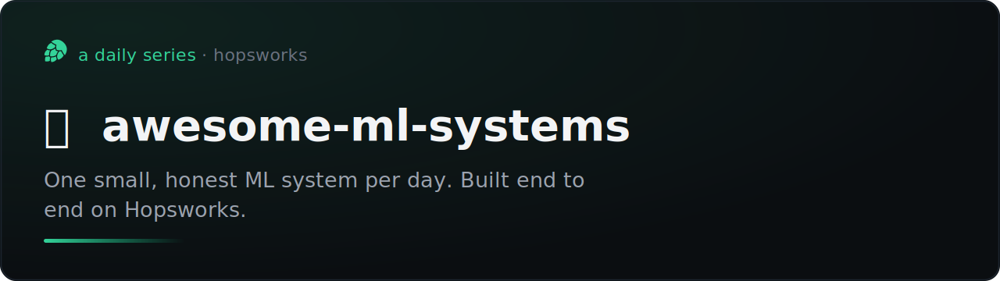

# awesome-ml-systems



[](#the-series)
[](https://www.hopsworks.ai/)

One small, honest ML system per day, each built end to end on
[Hopsworks](https://www.hopsworks.ai/). Same shape every time: an FTI (feature,
training, inference) pipeline, a real result with its caveats, and a served
model you can poke at. No notebooks-that-never-ship, no accuracy without a
holdout, no demo wired to a mock.

## The series

| # | system | the question | result | published | repo |
|---|---|---|---|---|---|
| 001 | README Vaporware Score | does a repo get abandoned, from its README text alone? | ROC-AUC 0.76 | 2026-06-29 | [readme-vaporware-score](https://github.com/MagicLex/readme-vaporware-score) |
| 002 | Asteroid Doomsday-o-meter | how big is an asteroid (so, how dangerous), from its Gaia spectrum alone? | size error ×1.13 vs ×1.34 blind | 2026-06-30 | [asteroid-size-from-light](https://github.com/MagicLex/asteroid-size-from-light) |
| 003 | Phishing at Issuance | is a freshly issued TLS certificate phishing, from its hostname alone? | ROC-AUC 0.78 holdout vs 0.50 blind | 2026-07-01 | [phish-at-issuance](https://github.com/MagicLex/phish-at-issuance) |
| 004 | Where on Earth | which country was a photo taken in, from its pixels alone? | top-1 52.3% / top-5 79.8% over 173 countries vs 21.2% zero-shot | 2026-07-02 | [where-on-earth](https://github.com/MagicLex/where-on-earth) |
| 005 | How Predictable. | can a machine learn your taste in 30 clicks, live, in front of you? | crowd prior 0.719 pairwise vs 0.511 zero-shot; per-user Bayesian layer climbs on-screen | 2026-07-03 | [how-predictable](https://github.com/MagicLex/how-predictable) |
| 006 | Live Sky Watch | where will every aircraft over Europe be in 60/180/300 s, and which one is not behaving like traffic here? | live same-sample: model 964 m vs physics 1427 m at 60 s where it intervenes; jamming grid + learned normalcy | 2026-07-06 | [live-sky-watch](https://github.com/MagicLex/live-sky-watch) |
| 007 | Ghost Fleet | which vessels behave like the sanctioned shadow fleet, from their AIS tracks alone? | 9.4x lift over a blind sanctions-list lookup, ROC-AUC 0.92 (population split); live network reveal | 2026-07-07 | [ghost-fleet](https://github.com/MagicLex/ghost-fleet) |
| 008 | the untested | which never-tested plant might fight a drug-resistant infection, from molecular structure alone? | mean AMR ROC-AUC 0.80, beats 1-NN Tanimoto on every scored head; recovers *Artemisia* for malaria from structure alone | 2026-07-08 | [the-untested](https://github.com/MagicLex/the-untested) |

## The standard

Every repo in the series follows the same mould, so they read as siblings.

**Shape.** An FTI system on Hopsworks. Sources to a feature pipeline to a
Feature Group, a Feature View to training to the Model Registry, a deployment to
an endpoint, an app that calls it. The skeleton lives in
[`templates/diagram.mmd`](templates/diagram.mmd).

**Banner.** Generated, not hand-drawn, so 30 of them stay consistent. Dark
canvas, emerald accent, the Hopsworks hop-mark as the fixed brand, only
title/tagline/emoji/index change per repo.

```bash
python tools/make_banner.py \
  --title "My System" \
  --tagline "What it predicts, in one honest sentence." \
  --emoji "🧪" --index 002 --out assets/banner.svg
```

**README.** Result first (with the metric and the holdout), then caveats, then
architecture (the diagram plus a file-by-file map), then reproduce, then the
served demo. Start from [`templates/README.template.md`](templates/README.template.md).

**Honesty rules.** The label is named and its proxy is stated. There is a
holdout number, not just cross-validation. No feature leaks the label. Heavy
fits run as Hopsworks jobs, not in a terminal. Feature extraction is one shared
function so training and serving cannot skew.

## New entry

```bash
mkdir ../my-new-system && cd ../my-new-system
cp -r ../awesome-ml-systems/tools .                       # the banner generator
cp ../awesome-ml-systems/templates/README.template.md README.md
python tools/make_banner.py --title "..." --tagline "..." --index NNN
# fill the README, paste templates/diagram.mmd, then add a row to the table above
```
